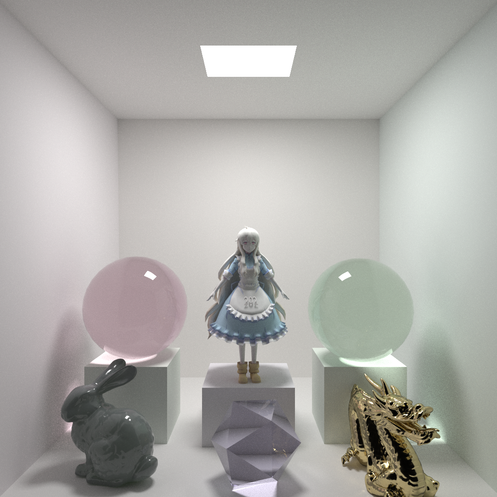
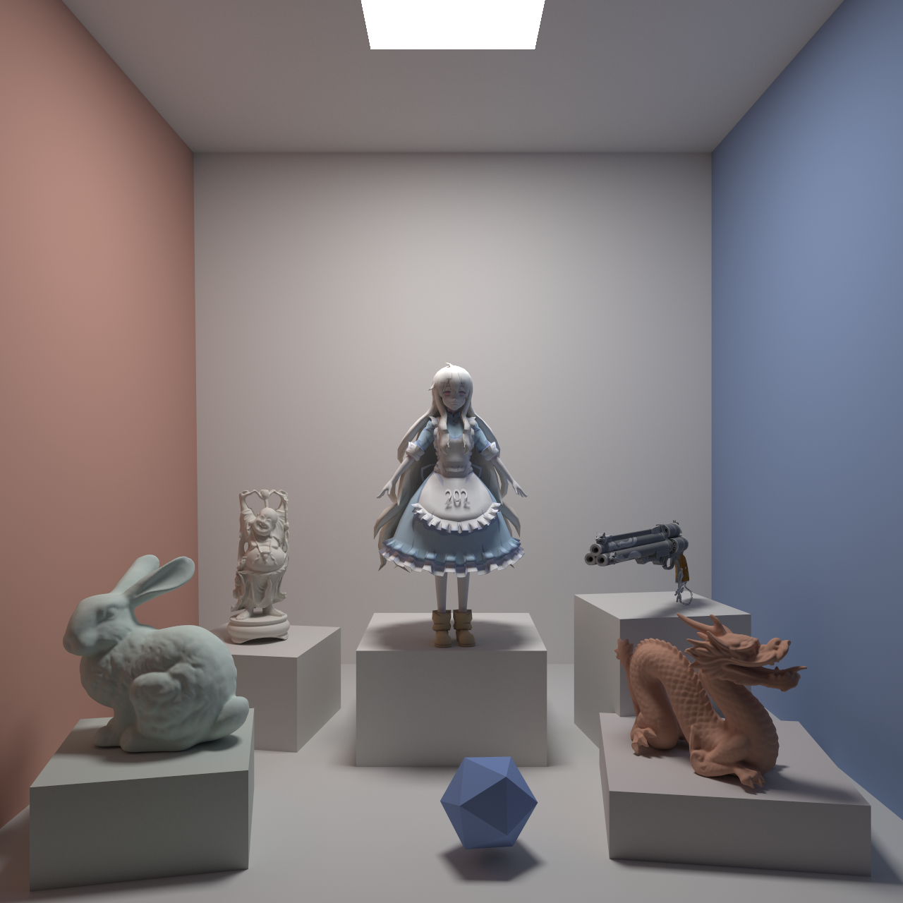
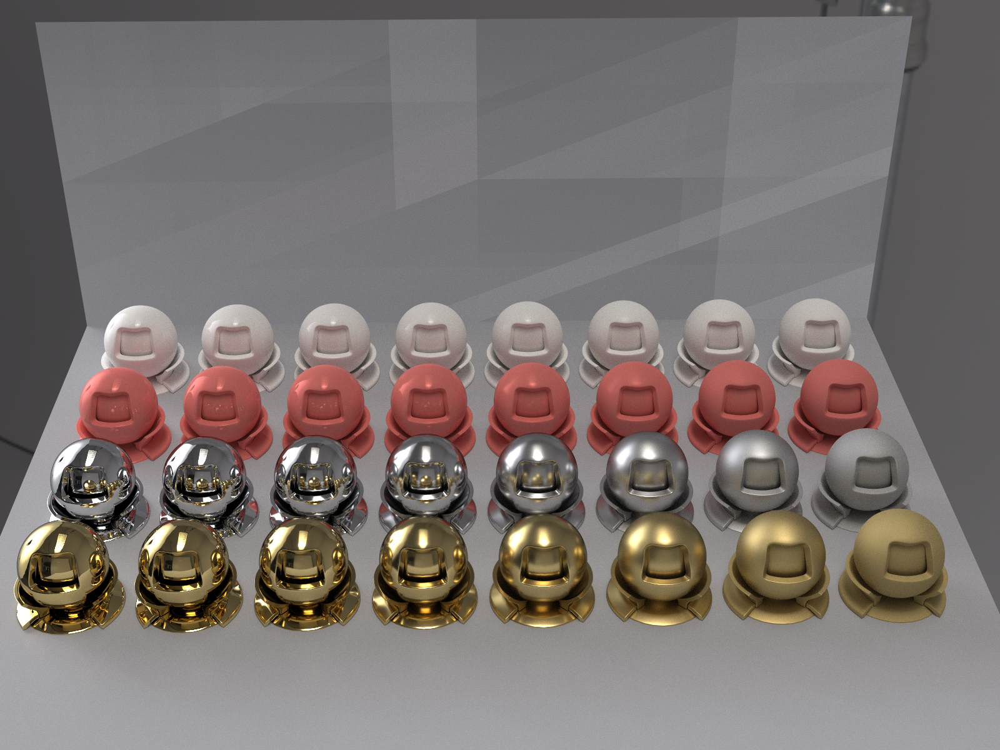
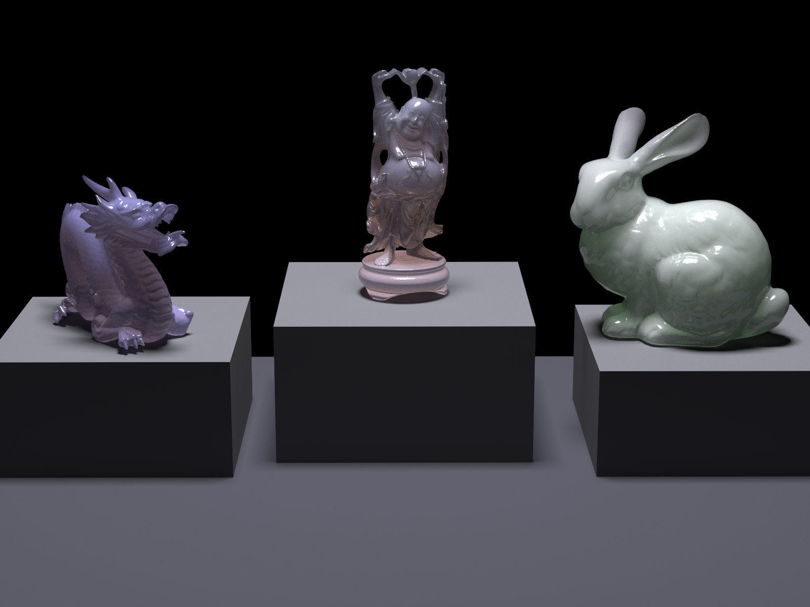
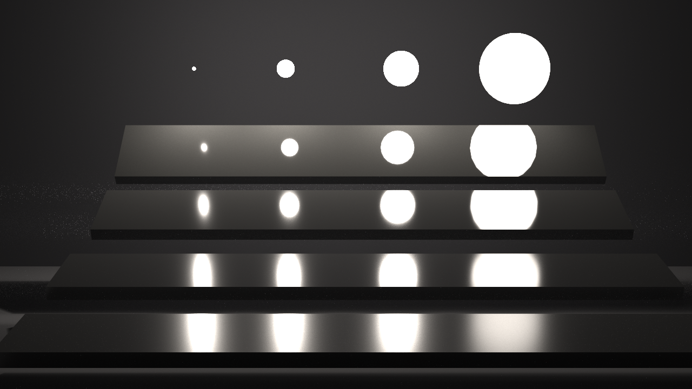
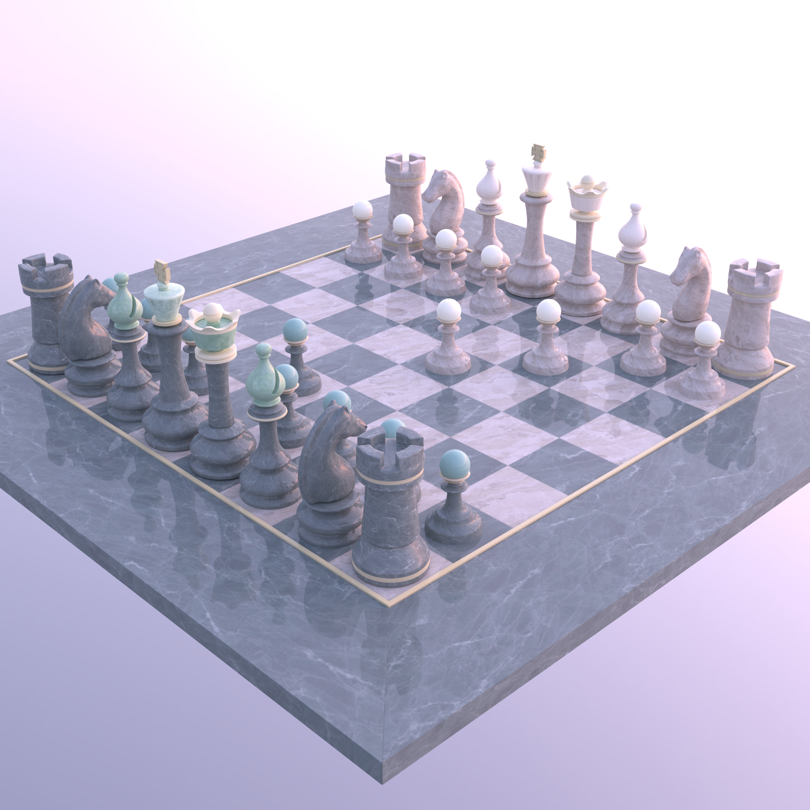
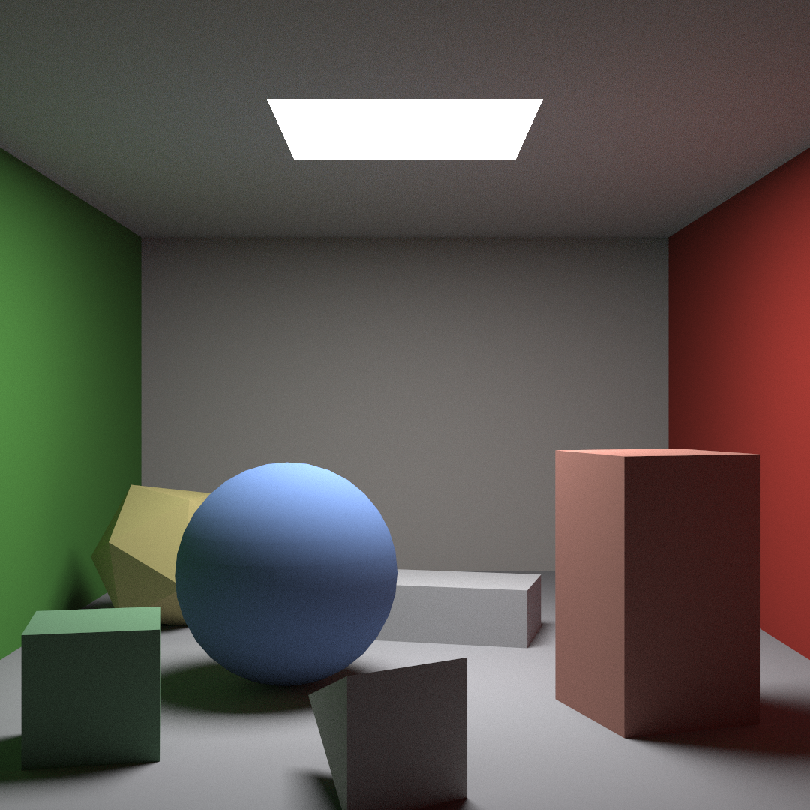
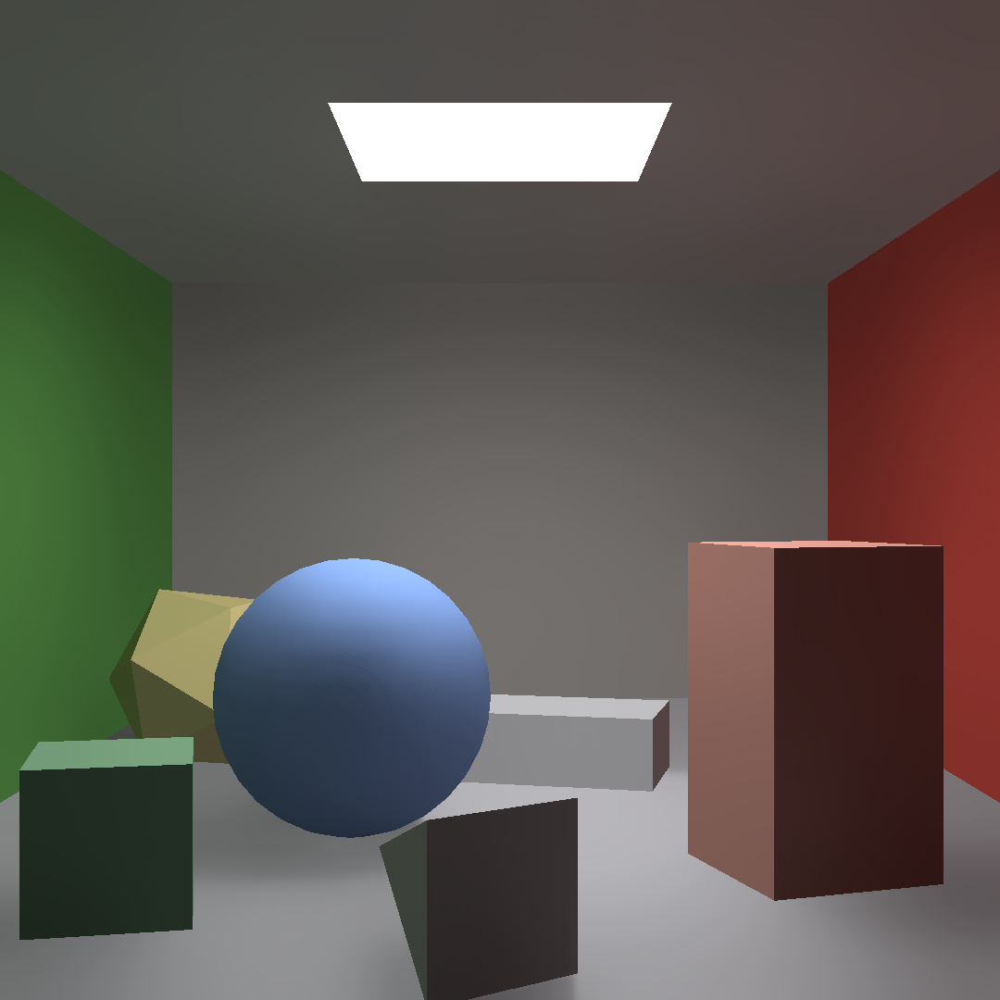

# cuda path tracer

## 实现功能

- Wavefront path tracing
- SAH BVH 构建和线性 BVH 遍历
- Diffuse、PBR、Subsurface Scattering、Dielectric材质
- Importance Sampling 和 MIS
- 面光源和 HDR 环境光
- SVGF降噪
- JSON 场景表示和 OBJ 导入

## 结果展示



### Diffuse




### PBR




### SSS




### MIS




### Envmap




### SVGF

不使用SVGF、`512 spp` 的结果：



使用SVGF结果：



## 项目结构

```text
CudaRayTracer/
|- Src/
|  |- Core/        # BVH、相机、材质、光源、采样器、渲染器
|  `- Utils/       # OBJ 导入、Shader、UI
|- Shader/         # OpenGL Shader
|- Scene/          # 场景 JSON
`- ThirdParty/     # 第三方库
```

## 构建

### 环境
- Windows
- NVIDIA GPU
- CUDA Toolkit 12.x
- Visual Studio 2022
- OpenGL

### CMake

项目里带了两个 preset：

- `Windows-Debug`
- `Windows-Release`

示例命令：

```bash
cmake --preset Windows-Release
cmake --build build --config Release
```

## 运行

程序启动时需要传一个场景 JSON：

```bash
cd build/Release
.\CudaRayTracer.exe ..\..\Scene\PBR\cornell-box-gold.json
```


## 交互

- 右键拖动：旋转相机
- 中键拖动：平移
- 滚轮：缩放
- ImGui 面板里可以切换渲染目标、改相机参数
- 按 `P` 可以截图


## References

1. [McGuire Computer Graphics Archive](https://casual-effects.com/data/)
2. [Fluora: A CUDA PBR path tracer](https://github.com/bdwhst/Fluora/tree/main)
3. [Limehouse HDRI • Poly Haven](https://polyhaven.com/a/limehouse)
4. [GAMES202: 高质量实时渲染](https://sites.cs.ucsb.edu/~lingqi/teaching/games202.html)
5. [Physically Based Rendering: From Theory to Implementation](https://www.pbrt.org/)
6. [Implementation of Spatiotemporal Variance-Guided Filtering (SVGF)](https://github.com/jacquespillet/SVGF)
7. [CIS 5650: GPU Programming and Architecture](https://cis565-fall-2023.github.io/syllabus/)
